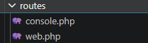
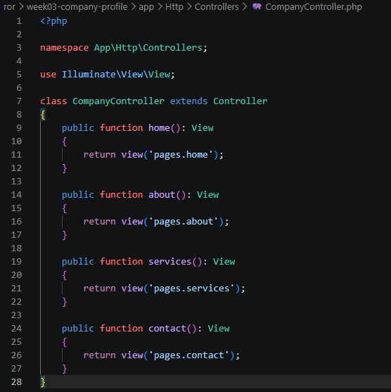
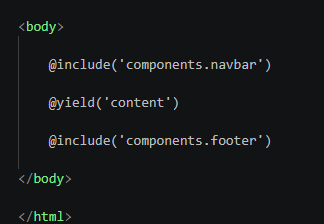
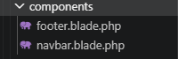
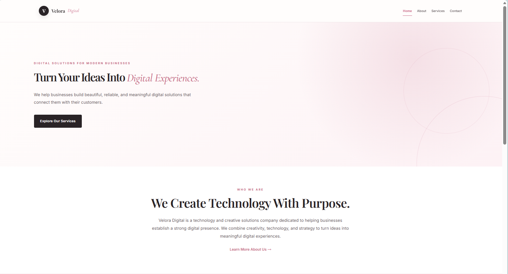
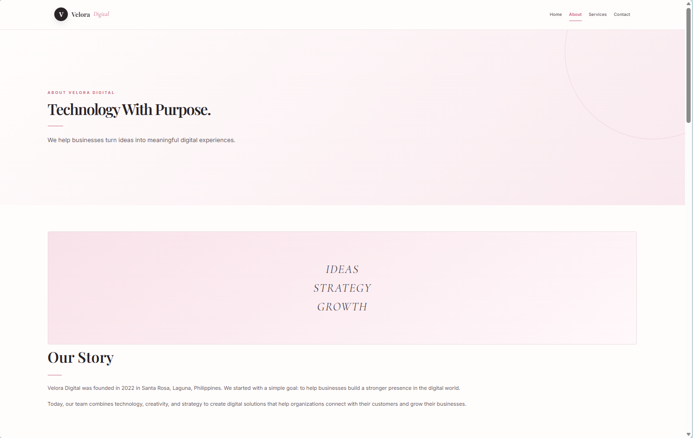
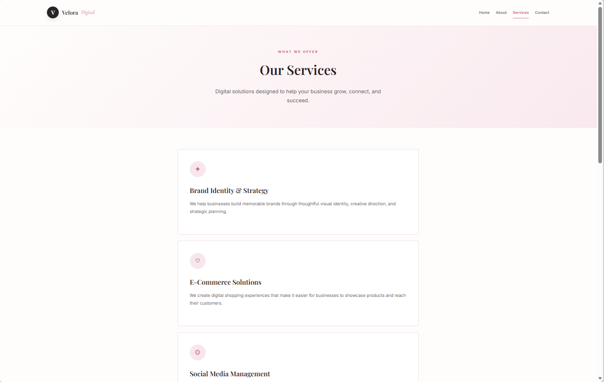
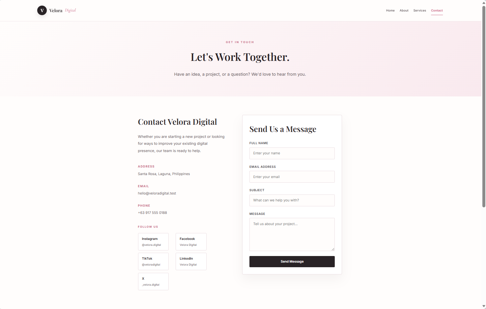
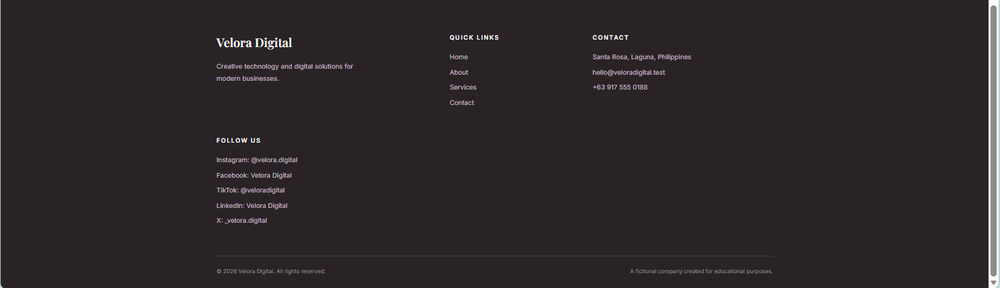

## 1. Project Title

**Velora Digital - Company Profile Website**

---

## 2. Introduction

### What is a Company Profile Website?

A Company Profile Website is a website that presents important information about a company, organization, or business in one online platform. It usually contains information such as the company's background, services, team members, values, contact information, and other details that help visitors understand the organization.

### Why Businesses Need a Company Profile Website

Businesses need a company profile website because it provides a professional online presence and allows customers and potential clients to easily learn about the company. A website can help establish credibility, showcase services, provide contact information, and make important business information available to visitors at any time.

### Purpose of the Project

The purpose of this project is to develop a responsive and professional company profile website for **Velora Digital**, a fictional digital solutions company.

The project demonstrates the use of Laravel, PHP, Blade templating, routing, controllers, reusable components, HTML, CSS, JavaScript, and Git version control.

The website provides information about Velora Digital, its company story, services, team members, contact information, and social media accounts.

---

## 3. Objectives

The following objectives were accomplished during the development of the project:

- Develop a functional company profile website using Laravel.
- Create multiple pages including Home, About, Services, and Contact.
- Implement Laravel routing for website navigation.
- Apply the MVC architecture in organizing the application.
- Create and use a Laravel controller.
- Use Blade templates for reusable and organized page layouts.
- Implement reusable Blade components such as the navigation bar and footer.
- Create a responsive and professional website design.
- Add team member images and information.
- Add company contact information.
- Add fictional social media accounts.
- Practice Git version control and GitHub repository management.
- Organize the Laravel project according to its standard folder structure.

---

# 4. MVC Architecture

## What is MVC?

MVC stands for **Model-View-Controller**. It is a software architectural pattern that separates an application into three main parts: the Model, View, and Controller.

### Model

The Model is responsible for handling data and data-related logic. It represents the information used by the application and can communicate with a database when needed.

### View

The View is responsible for displaying information to the user. In Laravel, Blade templates are commonly used to create the application's views.

### Controller

The Controller handles requests from the user and connects the application's routes with the appropriate application logic and views. Controllers help organize request-handling logic instead of placing everything directly inside route files.

## Why Laravel Uses MVC

Laravel uses an MVC-based structure because it provides an organized way of developing web applications. It separates application logic, data, and presentation, making the project easier to understand, maintain, and expand.

## Advantages of MVC

The MVC architecture provides several advantages:

- **Separation of concerns** - Each part of the application has a specific responsibility.
- **Maintainability** - Changes can be made to one part without unnecessarily affecting other parts.
- **Organization** - Files and responsibilities are easier to locate.
- **Reusability** - Views and components can be reused throughout the application.
- **Scalability** - The structure can support larger applications as the project grows.
- **Team collaboration** - Developers can work on different parts of the system more easily.

## MVC Flow

```text
Browser
   │
   ▼
 Route
   │
   ▼
Controller
   │
   ▼
Blade View
   │
   ▼
Response to Browser
````

For this project, the browser sends a request to a Laravel route. The route determines which part of the application should handle the request. The controller then returns the appropriate Blade view, which is rendered and returned to the browser.

---

# 5. Laravel Routing

## What is Routing?

Routing determines how an application responds to requests made to specific URLs. In Laravel, routes define the URI and the action that should be performed when that URI is requested.

The project's web routes are defined in:

```text
routes/web.php
```

## Named Routes

Named routes allow routes to be given a specific name. Instead of repeatedly writing a URL throughout the application, the route name can be used to generate the appropriate URL.

Example:

```php
Route::get('/about', [CompanyController::class, 'about'])
    ->name('about');
```

The named route can then be referenced in a Blade view:

```php
{{ route('about') }}
```

Named routes make navigation easier to manage because the URL does not have to be repeated throughout the application.

## GET Requests

A GET request is commonly used when a user wants to retrieve or view a webpage.

Example:

```php
Route::get('/', [CompanyController::class, 'home'])
    ->name('home');
```

When a visitor opens the home URL, Laravel matches the request with this route and calls the corresponding controller method.

## Route Definitions

The project uses routes for the main company profile pages:

```php
use App\Http\Controllers\CompanyController;
use Illuminate\Support\Facades\Route;

Route::get('/', [CompanyController::class, 'home'])
    ->name('home');

Route::get('/about', [CompanyController::class, 'about'])
    ->name('about');

Route::get('/services', [CompanyController::class, 'services'])
    ->name('services');

Route::get('/contact', [CompanyController::class, 'contact'])
    ->name('contact');
```

### Screenshot - Route Definitions



---

# 6. Controllers

## Purpose of Controllers

Controllers are used to organize the request-handling logic of a Laravel application. Instead of placing large amounts of logic directly inside route definitions, related actions can be placed inside a controller.

The project's controller is located in:

```text
app/Http/Controllers/CompanyController.php
```

## Benefits of Controllers

Controllers provide several benefits:

* Organize application logic.
* Keep route files cleaner.
* Make code easier to maintain.
* Group related actions together.
* Improve separation between routing and application logic.
* Make applications easier to expand.

## Controller Methods

The `CompanyController` handles the pages of the company profile website.

Example:

```php
<?php

namespace App\Http\Controllers;

class CompanyController extends Controller
{
    public function home()
    {
        return view('pages.home');
    }

    public function about()
    {
        return view('pages.about');
    }

    public function services()
    {
        return view('pages.services');
    }

    public function contact()
    {
        return view('pages.contact');
    }
}
```

Each method returns the Blade view corresponding to a specific page.

### Screenshot - CompanyController.php



---

# 7. Blade Templating Engine

## What is Blade?

Blade is Laravel's templating engine. It allows developers to create dynamic and reusable views using `.blade.php` files.

Blade templates are stored inside:

```text
resources/views
```

## Blade Layouts

A Blade layout provides a common structure that can be shared by multiple pages.

The main layout of this project is:

```text
resources/views/layouts/app.blade.php
```

The layout contains common elements such as the navigation bar, styling, page content area, and footer.

## Blade Components

Reusable parts of the website are stored as Blade components.

This project includes:

```text
resources/views/components/navbar.blade.php
resources/views/components/footer.blade.php
```

The navigation bar and footer can therefore be reused across multiple pages.

## `@extends`

The `@extends` directive allows a Blade page to use a particular layout.

Example:

```php
@extends('layouts.app')
```

This means that the page uses:

```text
resources/views/layouts/app.blade.php
```

## `@section`

The `@section` directive defines content that will be placed inside a section of the layout.

Example:

```php
@section('content')

    <h1>Welcome to Velora Digital</h1>

@endsection
```

## `@yield`

The `@yield` directive creates a location in the layout where section content will appear.

Example in `app.blade.php`:

```php
@yield('content')
```

The content defined using:

```php
@section('content')
```

will be displayed in this location.

## `@include`

The `@include` directive allows reusable Blade files to be inserted into another Blade file.

Example:

```php
@include('components.navbar')
```

and:

```php
@include('components.footer')
```

This prevents the navigation bar and footer from having to be copied into every page.

## Blade Layout Example

```php
<!DOCTYPE html>
<html>

<head>
    <title>Velora Digital</title>
</head>

<body>

    @include('components.navbar')

    @yield('content')

    @include('components.footer')

</body>

</html>
```

## Blade Page Example

```php
@extends('layouts.app')

@section('content')

<section class="hero">

    <h1>
        Turn Your Ideas Into
        <span>Digital Experiences.</span>
    </h1>

</section>

@endsection
```

### Screenshot - Blade Layout



### Screenshot - Blade Components



---

# 8. Laravel Folder Structure

Laravel organizes applications into several folders, each with a specific purpose.

## `app/`

The `app` folder contains the core application code. It includes controllers and other classes used by the application.

Example:

```text
app/
└── Http/
    └── Controllers/
        └── CompanyController.php
```

## `routes/`

The `routes` folder contains route definitions that determine how the application responds to different URLs.

For this project:

```textF
routes/
└── web.php
```

## `resources/`

The `resources` folder contains views and other frontend resources.

This project uses:

```text
resources/
└── views/
    ├── components/
    │   ├── navbar.blade.php
    │   └── footer.blade.php
    │
    ├── layouts/
    │   └── app.blade.php
    │
    └── pages/
        ├── home.blade.php
        ├── about.blade.php
        ├── services.blade.php
        └── contact.blade.php
```

## `public/`

The `public` folder contains publicly accessible assets such as images, CSS, JavaScript, and the application's entry point.

The team images are stored in:

```text
public/
└── images/
    ├── girl.jpg
    ├── bakla.jpg
    ├── tomboy.jpg
    └── boy.jpg
```

## `bootstrap/`

The `bootstrap` folder contains files used to initialize the Laravel framework and application environment.

## `config/`

The `config` folder contains configuration files for different parts of the Laravel application.

---

# 9. Screenshots

The following screenshots document the completed Velora Digital company profile website and its Laravel implementation.

## Home Page



## About Page



## Services Page



## Contact Page



## Navigation Bar


## Footer



## Route Definitions


## Controller


## Blade Layout


## Blade Components


---

# 10. Problems Encountered

Several challenges were encountered during the development of the Velora Digital company profile website.

## Problem 1: Route Not Found

One of the challenges encountered was navigating between the different pages of the website. A route that was not correctly defined or named could cause the requested page to fail to load.

This was especially important when connecting the navigation links to the Home, About, Services, and Contact pages.

## Problem 2: View Not Found

Another challenge was ensuring that the Blade view names and file locations matched the names used by the routes and controllers.

A mismatch between a view reference and the actual Blade file location could result in a "View not found" error.

## Problem 3: Blade Syntax and Layout Issues

Another challenge involved Blade syntax and reusable layouts. Incorrect placement of directives such as `@extends`, `@section`, `@yield`, and `@include` could cause the page structure or content to display incorrectly.

The navigation bar, footer, and page-specific content also had to be organized carefully.

## Problem 4: Styling and Layout Issues

The website required several CSS adjustments. Changes were made to the navigation bar, team cards, images, social media section, and footer.

The website had to be tested repeatedly in the browser to make sure that changes to one part of the design did not negatively affect the other pages.

---

# 11. Solutions

## Solution to Route Problems

The route definitions were checked in:

```text
routes/web.php
```

Each page was given an appropriate route and route name. Named routes were then used for website navigation.

Example:

```php
Route::get('/about', [CompanyController::class, 'about'])
    ->name('about');
```

The route name can then be used with:

```php
{{ route('about') }}
```

## Solution to View Problems

The Blade view files were organized inside:

```text
resources/views/pages/
```

The controller methods were checked to make sure that they returned the correct view names.

For example:

```php
return view('pages.about');
```

corresponds to:

```text
resources/views/pages/about.blade.php
```

## Solution to Blade Layout Problems

The layout structure was organized using Blade directives.

The main layout contains:

```php
@yield('content')
```

Individual pages use:

```php
@extends('layouts.app')

@section('content')

    <!-- Page content -->

@endsection
```

Reusable elements use:

```php
@include('components.navbar')

@include('components.footer')
```

This helped keep the website organized and prevented the same navigation and footer code from being repeated on every page.

## Solution to Styling Problems

The website was tested repeatedly after CSS changes. Common styles were organized in the main layout so they could be applied consistently across the website.

The team photos were placed inside:

```text
public/images/
```

and displayed using standard HTML image elements:

```html

```

---

# 12. Reflection

Developing the Velora Digital company profile website helped me understand how Laravel organizes a web application using the MVC architecture. Before working with Laravel, I mainly viewed a website as a collection of HTML, CSS, and JavaScript files. Through this project, I learned that Laravel provides a structured way of connecting routes, controllers, and views, with each part having a specific responsibility.

I learned that MVC stands for Model, View, and Controller. The Model is responsible for handling data and data-related logic, the View is responsible for presenting information to the user, and the Controller handles application requests and connects the routes with the appropriate views. Although this project mainly focused on a company profile website and did not require complex database operations, understanding MVC helped me see how the same architecture can be applied to more complex applications.

Separation of concerns is important because it makes software easier to understand, maintain, and modify. For example, routes determine which URL should be accessed, controllers handle the request and determine which view should be returned, while Blade views focus on how information is presented. If all of these responsibilities were placed into one large file, making changes would become more difficult and errors would be harder to identify.

I also learned how routes, controllers, and views work together. When a user visits a URL, Laravel checks the route definitions to determine which route matches the request. The route can then call a controller method. The controller returns the appropriate Blade view, and Laravel renders the view and sends the response back to the browser. Understanding this flow made the structure of a Laravel application clearer to me.

Blade templating was another important part of the project. Using `@extends`, `@section`, `@yield`, and `@include` allowed me to create reusable layouts and components. Instead of copying the navigation bar and footer into every page, I created reusable components and included them in the main layout.

The project also showed me why organized architecture is important for larger enterprise systems. A larger application can contain many pages, users, database models, business rules, and developers. MVC and separation of concerns make it easier to divide responsibilities, maintain the system, and add new features without making the entire application difficult to manage.

Overall, this project improved my understanding of Laravel, routing, controllers, Blade templates, reusable components, responsive design, and Git version control. More importantly, I learned that good software development is not only about making an application work, but also about organizing the code so that it can be understood, maintained, and expanded in the future.

---

# 13. References

Laravel. (n.d.). *Blade templates*. Laravel Documentation.
https://laravel.com/docs/12.x/blade

Laravel. (n.d.). *Controllers*. Laravel Documentation.
https://laravel.com/docs/12.x/controllers

Laravel. (n.d.). *Directory structure*. Laravel Documentation.
https://laravel.com/docs/12.x/structure

Laravel. (n.d.). *Routing*. Laravel Documentation.
https://laravel.com/docs/12.x/routing

MDN Web Docs. (n.d.). *MDN Web Docs*. Mozilla.
https://developer.mozilla.org/en-US/docs/MDN

MDN Web Docs. (n.d.). *Web technology for developers*. Mozilla.
https://developer.mozilla.org/en-US/docs/Web

PHP Documentation Group. (n.d.). *PHP manual*. PHP.net.
https://www.php.net/manual/en/

Tailwind Labs. (n.d.). *Tailwind CSS documentation*.
https://tailwindcss.com/docs  


## Architecture Diagram


